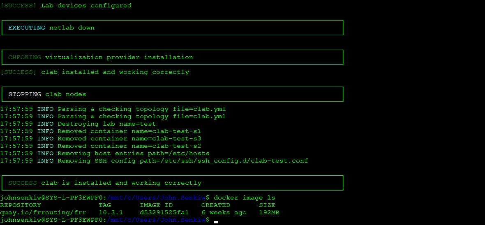
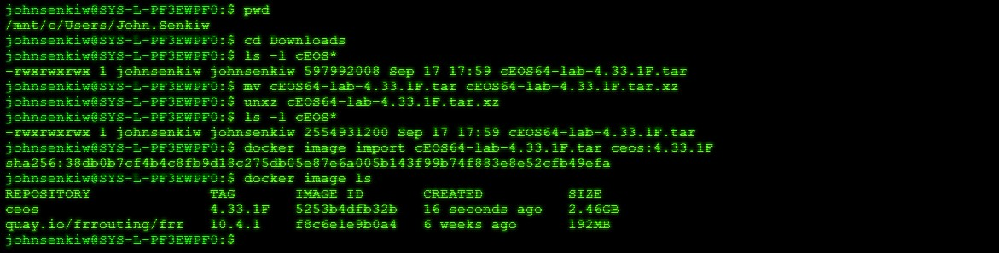
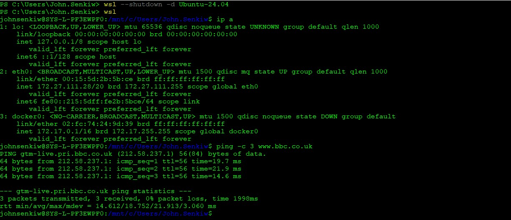
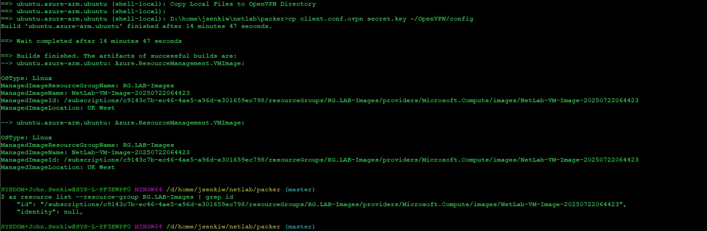

# NETLAB

Useful Links:

[**Netlab Documentation**](https://netlab.tools)

[**Netlab Blog**](https://blog.ipspace.net/tag/netlab/)

[**Open-Source BGP Configuration Labs**](https://bgplabs.net/)

[**IP Space Netlab Examples**](https://github.com/ipspace/netlab-examples)

For an overview of what Netlab can do and what technologies it uses refer to the online Netlab Documentation. 


## Building NetLab on Windows 11 Client

**Local administration rights will be required on the Windows client.**

### Install WSL2

Install Windows Subsystem for Linux: [**WSL2**](https://learn.microsoft.com/en-us/windows/wsl/install)

Verify the WSL2 Install and remove the default Ubuntu Distribution.

```
wsl -v
wsl --list
wsl --unregister Ubuntu
```

Install the latest Ubuntu LTS 24.04 Distribution. The install will prompt to create a userid and password then start the OS and place you at a Bash CLI.  

```
wsl --list --online
wsl --install -d Ubuntu-24.04
```

### Install Netlab on Ubuntu 24.04

```
sudo apt update
sudo apt-get upgrade -y
```
Install NetLab

```
sudo apt-get install -y python3-pip
sudo pip3 install --ignore-installed --break-system-packages networklab
sudo pip3 install --upgrade --break-system-packages  pyopenssl cryptography

netlab install -y ubuntu ansible containerlab libvirt
```
Add the userid to the docker + libvirt groups, logoff and logon again.
```
id
sudo usermod -aG docker <userid>
sudo usermod -aG libvirt <userid>
exit
wsl
id
```
Verify that NetLab has installed correctly with the containerlab + libvirt virtualisation providers.

```
netlab test clab
netlab test libvirt
```
The *netlab test* commands should create and destroy a network topology using docker frr containers during the clab test and bento/ubuntu-24.04 boxes during the libvirt test. 

A successful *install* message should be received once complete.



The docker and vagrant images that were automatically download during the test run can be verified. 

```
docker image ls
```

```
vagrant box list
```

### Installing Arista EOS Container

Verify the default container image version of NetLab version of cEOS.

```
netlab show images -d eos
```

Register and create an account with Arista. [**Arista-Login**](https://www.arista.com/en/login)

Download the container image version from the Arista Software Download page: [**Arista-Downloads**](https://www.arista.com/en/support/software-download). 


Locate the downloaded tar file from within WSL2. Rename and unzip the file.

```
pwd
cd Downloads
ls -l cEOS*
mv cEOS64-lab-4.33.1F.tar cEOS64-lab-4.33.1F.tar.xz
unxz cEOS64-lab-4.33.1F.tar.xz
```
Install the Docker image and verify the installation has been successful. 

```
docker image import cEOS64-lab-4.33.1F.tar ceos:4.33.1F
docker image ls
```


### Running an Initial NetLab Topology

Clone BGP Labs. 

We'll use a simple topology within these Labs to demostrate basic NetLab functionality.

```
cd ~
pwd
git clone https://github.com/bgplab/bgplab.git
ls -l
```
Edit the *defaults.yml* file to use the cEOS image: 

```
cd bgplab
sudo vi defaults.yml
<...>
device: eos
provider: clab
<...>
```

Deploy the topology and connect to the command line of one of the eos nodes within the Lab. 

```
cd ~/bgplab/basic/1-session/
netlab up
netlab status
netlab connect rtr
```
Explore the eos command line:

```
show ip interfce brief
show running-config
ping 10.1.0.2
exit
```
```
netlab connect x1
```
Explore the frr command line:

```
vtysh
show interface brief
show running-config
ping 10.1.0.1
exit
exit
```
To complete the BGP LAB exercise of configuring an eBGP session between the two nodes refer to the guidelines: [**BGP-LAB1**](https://bgplabs.net/basic/1-session/)

Once you are finshed destroy the Lab.

```
netlab down --cleanup
exit
wsl --shutdown
```

You have now Installed Netlab on a Windows 10 client and deployed a basic topology with eos and frr nodes using the container virtualisation provider. 

Due to limitations with Nested Virtualisation NetLab cannot utilise KVM/QEMU (libvirt) on a Window 10 client. If libvirt is required or resources on a local client are insufficient then a NetLab Public Cloud deployment is an good alternative.  

**Windows 11 Note: Although KVM/QEMU (libvirt) is available due to nested virtualisation being allowed I've encountered vagrant-libvirt issues which I'm attempting to resolve.**

### Troubleshooting: DNS Resolution Issue

If DNS Resolution on WSL install does not function correctly */etc/wsl.conf* and */etc/systemd/resolved.conf* should be edited to include the following lines:

```
sudo vi /etc/wsl.conf
<...>
[network]
generateResolvConf = false
<...>

sudo vi /etc/systemd/resolved.conf
<...>
[Resolve]
DNS=8.8.8.8 8.8.4.4
<...>
```

Restart WSL. 
```
wsl --shutdown
wsl
```
Internet DNS resolution should now function correctly. 



## Building NetLab in Azure Cloud

**Ensure you have a Microsoft Azure account and Contributor access to a Azure Subscription.**

[**Azure**](https://azure.microsoft.com/en-gb/pricing/purchase-options/azure-account)

### Install Prerequisite Software on Window Client

All Provisioning was performed on a Windows Enterprise 10 Build 19045 Client 

Install Azure CLI: [**Azure CLI**](https://learn.microsoft.com/en-us/cli/azure/install-azure-cli-windows?view=azure-cli-latest&pivots=winget)

Install Git for Windows: [**Git for Windows**](https://gitforwindows.org/)

Install OpenVPN: [**OpenVPN**](https://openvpn.net/community-downloads/)

Install Hashicorp Packer: [**Packer**](https://developer.hashicorp.com/packer/install)

Install Hashicorp Terraform: [**Terraform**](https://developer.hashicorp.com/terraform/install) 

Verify Installation of all prerequesite software through the Powershell CLI:  

```
az --version
git --version
openvpn --version
ssh -V
packer --version 
terraform --version
```

### Image Build + Instance Provisioning

Authenticate to Azure and select the correct subscription to build resources.

```
az login
az account list
az account show
az account set --name "Systal DevTest"
```

The "*Systal DevTest*" is a subscription where I have Contributor role which 
enables me to create and delete Azure resources such as Images, Virtual 
Network, Network Security Group + Virtual Machine Instances.

Create a Resource Group for the Packer Image builds. The Resource Group name must be unique within the Azure Subscription.

```
az group create --name <RG-NAME> --location ukwest
```

Locally create keys for necessary for SSH and OpenVPN.

```
git clone
cd packer
ssh-keygen -f ~/.ssh/netlab -t rsa -b 4096 -N ""
openvpn --genkey secret secret.key
```
Verify the Resource Group is created. No resources should currently exist of course. 

```
az resource list --resource-group RG.LAB-Images | grep id
```
Create a NetLab base image using Packer. 

```
packer validate ubuntu-24.04.pkr.hcl
packer build ubuntu-24.04.pkr.hcl
```

The build process should take a few minutes and will install NetLab on a Ubuntu LTS base image together with prerequisite software.Additionally any Vagrant KVM boxes in the local *image* directory will be copied to the NetLab base image.



The Resource Group should now contain the new NetLab base image. Copy the *image-id* displayed as it will be used to launch an the NetLab instance through Terraform. When prompted by Terraform in the plan and apply process for the base-image variable paste in the *image-id*. Reply *yes* to the approval prompts in both the plan and apply process.     

```
az resource list --resource-group RG.LAB-Images | grep id

cd ../terraform

terraform init
terraform plan
terraform apply
```
Once the instance provisioning has completed start the OpenVPN client with the *clinet.conf.opvn* configuration file either through the client GUI or from the command line.

```
 openvpn --config <HOME-DIRECTORY-PATH>/OpenVPN/config/client.conf.ovpn --secret <HOME-DIRECTORY-PATH>/OpenVPN/config/secret.key
```
Using the OpenVPN GUI will probably be the better option as the command line execution may fail without administration level privileges. 

Once the VPN is established logon via ssh to the VM instance and verify that NetLab is installed correctly with both Containerlab and Libvirt virtualisation providers.

```
ssh -l netlab -i ~/.ssh/netlab -o StrictHostKeyChecking=no 192.168.122.1

netlab version
netlab test libvirt
netlan test clab
```
An initial 2-node lab can be deployed with the libvirt provider using isov image.

```
cd ~/initial
netlab up
netlab status
```
Access the routers within the topology via either the *netlab connect* command or direct via the ssh command.

```
netlab connect r1
ssh -l vagrant 192.168.121.101
```
Router configuration can now be protyped and tested. When complete destory the topology.    

```
netlab down
```

Logoff the and destory the VM instance.

```
az resource list --resource-group <IMAGE-RG> | grep id

terraform apply --destroy
```

## End