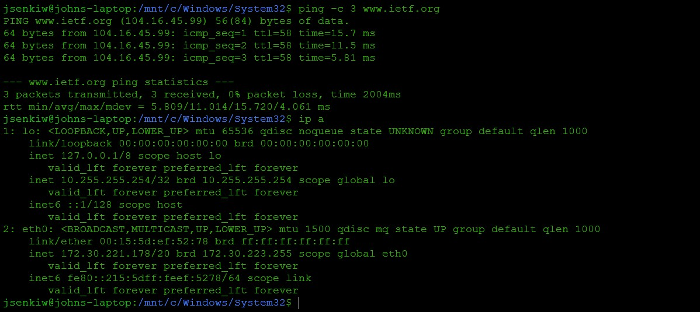
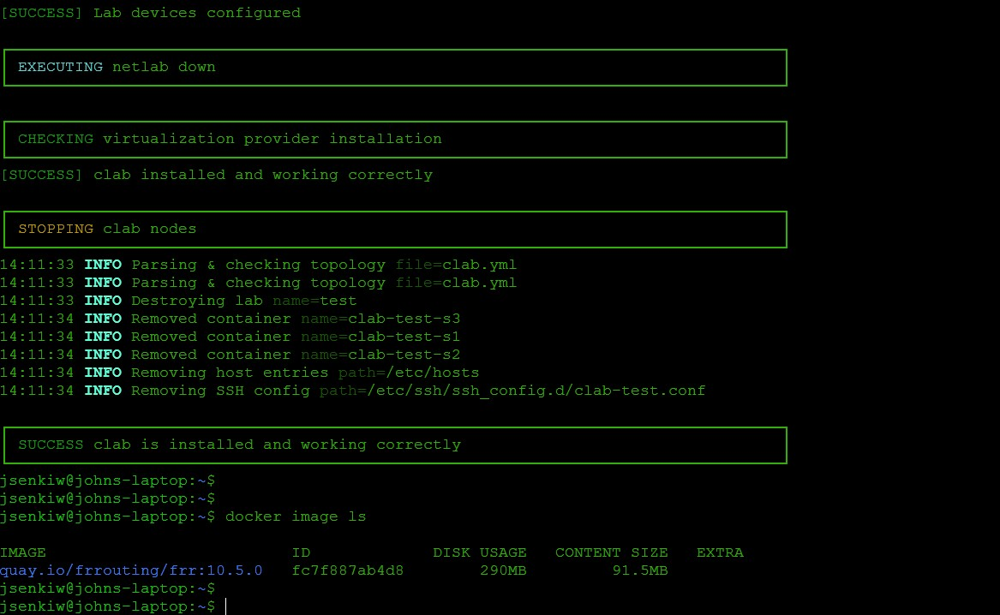
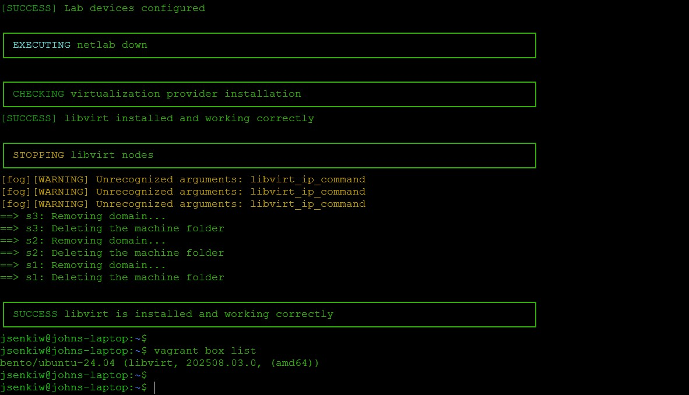
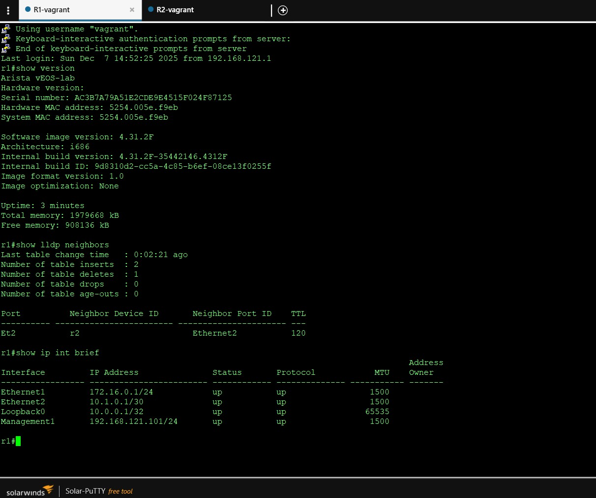

## Building Netlab on Windows 11 Client

**Local administration rights will be required on the Windows client.**

### Install WSL2

Install Windows Subsystem for Linux: [**WSL2**](https://learn.microsoft.com/en-us/windows/wsl/install)

Verify the WSL2 Install and remove the default Ubuntu Distribution unless LTS 24.04 has been installed by default.

```
wsl -v
wsl --list
wsl --unregister Ubuntu
```

Install the latest Ubuntu LTS 24.04 Distribution. The install will prompt to create a userid and password then start the OS and place you at a Bash CLI.  

```
wsl --list --online
wsl --install -d Ubuntu-24.04
```
Verify DNS Resolution. If DNS is not funtioning refer to the  [`Troubleshooting`](#troubleshooting) section.

```
ping -c 3 www.ietf.org
ip address
```



### Install Netlab on Ubuntu 24.04

Ensure repositories are refeshed and installed packages are upgraded to latest versions.

```
sudo apt update
sudo apt-get upgrade -y
```
Install Netlab with both the containerlab and libvirt virtualisation providers.

```
sudo apt-get install -y python3-pip
sudo pip3 install --ignore-installed --break-system-packages networklab
sudo pip3 install --upgrade --break-system-packages  pyopenssl cryptography
```
Install the containerlab and libvirt virtualisation providers.

```
netlab install -y ubuntu ansible containerlab libvirt
```
Add the userid to the docker + libvirt groups, logoff and logon again.
```
sudo usermod -aG docker,libvirt <userid>
id

exit
wsl
id
```

### Verify the Netlab Install: Containerlab Provider

Verify that Netlab has installed correctly with the containerlab virtualisation provider.

```
cd ~
netlab test clab
```
The *netlab test* command should create and destroy a network topology using docker frr containers during the clab test. 

A successful *install* message should be received once complete.



The docker image that was automatically downloaded during the test run can be verified. 

```
docker image ls
```

### Verify the Netlab Install: Libvirt Provider

Verify that Netlab has installed correctly with the libvirt virtualisation provider.

```
cd ~
export VAGRANT_WSL_ENABLE_WINDOWS_ACCESS="0"
netlab test clab
```
The *netlab test* command should create and destroy a network topology using bento/ubuntu-24.04 boxes during the libvirt test. 

A successful *install* message should be received once complete.



The vagrant box image that was automatically downloaded during the test run can be verified. 

```
vagrant box list
```

Update the *.bashrc file.

```
cd ~
vi .bashrc
<...>
cd ~
export VAGRANT_WSL_ENABLE_WINDOWS_ACCESS="0"
<...>
:wq
```

### Installing Arista EOS Container

Verify the default container image version of Netlab version of cEOS.

```
netlab show images -d eos
```

Register and create an account with Arista. [**Arista-Login**](https://www.arista.com/en/login)

Download the container image version from the Arista Software Download page: [**Arista-Downloads**](https://www.arista.com/en/support/software-download). 

Refer to the instructions on the Netlab documentation site: [**EOS-CLAB**](https://netlab.tools/labs/ceos/)

The tar archive can be added to Docker.

```
docker image import <image>.tar <tag>
```

### Installing Arista EOS Vagrant Box

Refer to the instructions on the Netlab documentation site: [**EOS-BOX**](https://netlab.tools/labs/eos/)

Once a box and associated json file are built it can be added to Vagrant.

```
vagrant box add <image>-box.json
```

### Running an Initial Netlab Topology

Create an empty directory and topology.yml file in the new directory.

```
cd ~
mkdir initial
cd initial
vi topology.yml

<...>
---
provider: libvirt
defaults.device: eos
module: [ ospf ]

nodes: [ r1, r2 ]
links: [ r1, r2, r1-r2 ]
<...>
:wq
```
Launch the new topology and once is has been deployed check the management IPv4 addresses of the router instances and logon to instance r1.

```
netlab up
netlab report mgmt

netlab connect r1
```

### Accessing Topology from Windows Host

Router instances can be access directly from the windows host using a ssh client via an addition of a static route on the windows host and updating the Ubuntu guest firewall (iptables) to allow inbound traffic on the management network. 

```
ip address show dev eth0
sudo iptables -I FORWARD -p all -i eth0 -o libvirt-mgmt -j ACCEPT
sudo iptables -L FORWARD -v 
```
```
route -p ADD 192.168.121.0 MASK 255.255.255.0 172.30.221.178
```
Connect to r1 and r2 using an ssh client directly on the Windows host machine.



When finished destroy the initial topology.

```
netlab down --cleanup
```

## End

## Troubleshooting

### DNS Resolution Issue

If DNS Resolution on WSL install does not function correctly */etc/wsl.conf* and */etc/systemd/resolved.conf* can be edited to include the following lines:

```
sudo vi /etc/wsl.conf
<...>
[network]
generateResolvConf = false
<...>
:wq

sudo vi /etc/systemd/resolved.conf
<...>
[Resolve]
DNS=8.8.8.8 8.8.4.4
<...>
:wq
```

Restart WSL. 
```
wsl --shutdown
wsl
```
Internet DNS resolution should now function correctly. 

### Vagrant Cleanup Issue

If trhe enviornment variable *VAGRANT_WSL_ENABLE_WINDOWS_ACCESS* is not set before running the *netlab test libvirt* command vagrant may fail to cleanup resources even though the test is successful. If this happens then resources should be manually removed before re-running the command.   

```
virsh list
virsh net-list
virsh vol-list default

virsh destroy test_s1
virsh undefine test_s1
virsh destroy test_s2
virsh undefine test_s2
virsh destroy test_s3
virsh undefine test_s3

virsh net-destroy test_1
virsh net-destroy test_2
virsh net-destroy vagrant-libvirt


virsh vol-delete test_s1.img --pool default
virsh vol-delete test_s2.img --pool default
virsh vol-delete test_s3.img --pool default
```